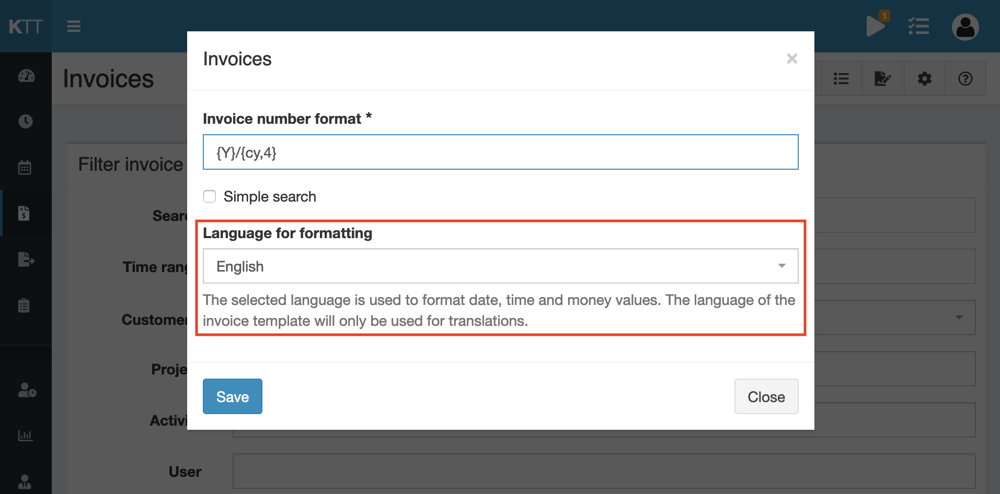

# Kimai 2 - Invoice format fixation

[](https://github.com/Keleo/InvoiceFormatFixationBundle/actions)

Kimai extension to configure a language, which will be used to format money, date and time values in invoices.

Adds a new system-configuration to the invoice section, which can be reached by clicking the "gear" icon in the invoices pge actions.

- If you don't select a language, the default behavior of Kimai applies: all values will be formatted in the invoice template language
- If you select a language, this language will be used to format all values and the invoice template language will be used for translations only   




## Installation

First clone it to your Kimai installation `plugins` directory:
```
cd /kimai/var/plugins/
git clone https://github.com/Keleo/InvoiceFormatFixationBundle.git
```

Then rebuild the cache: 
```
cd /kimai/
bin/console kimai:reload -n
```

Change to the invoice page and open the configuration mode (via the gear icon). 
